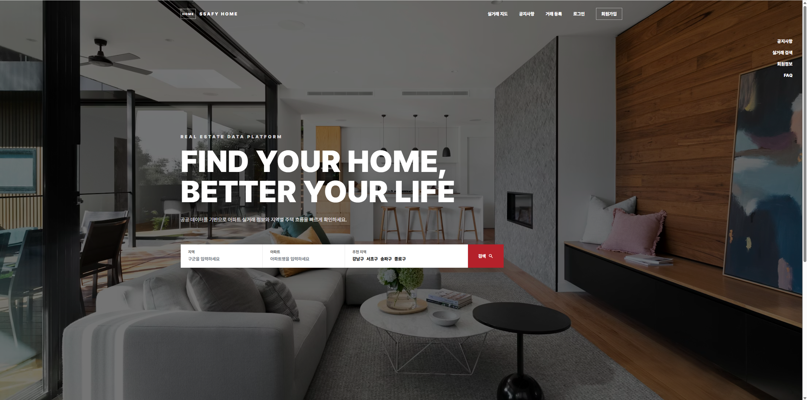
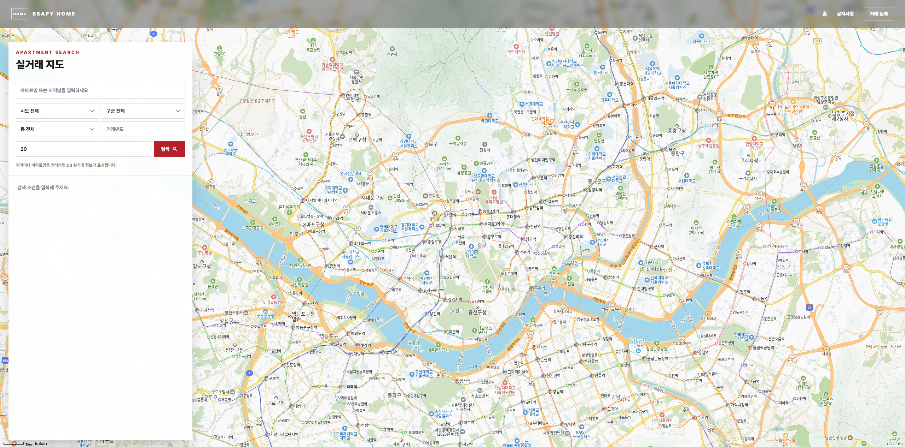
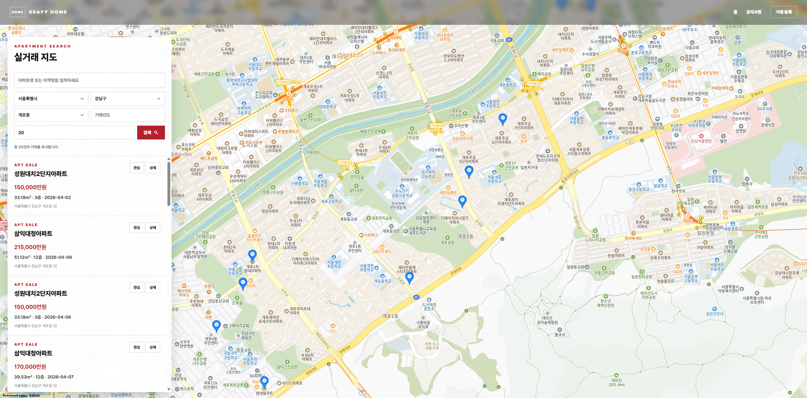
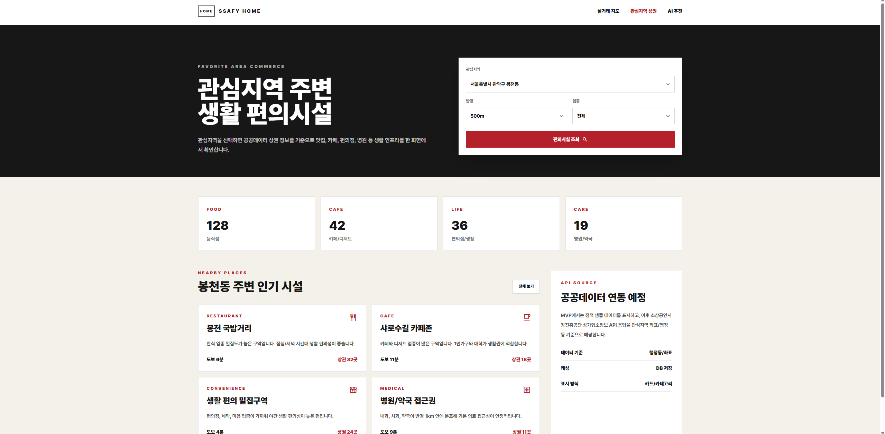
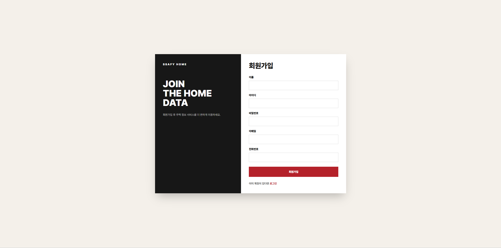
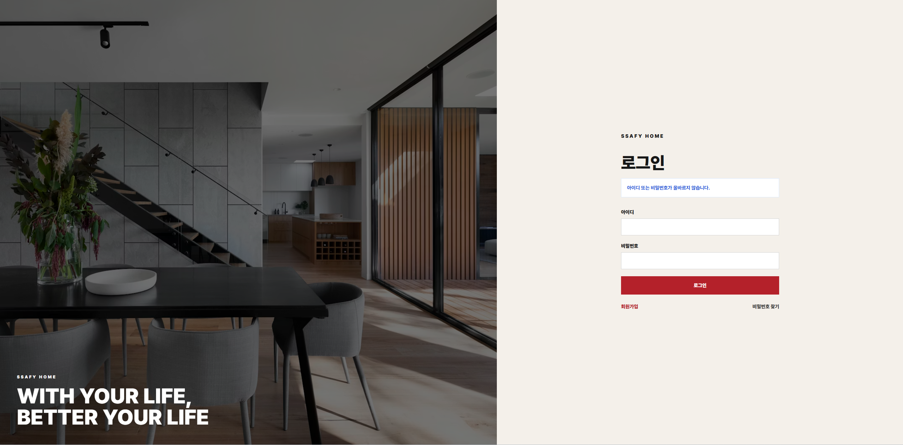
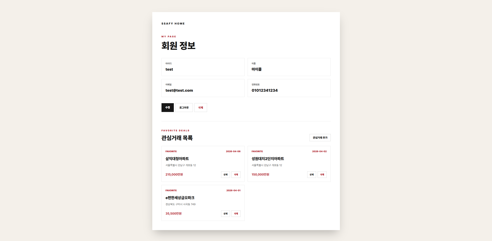
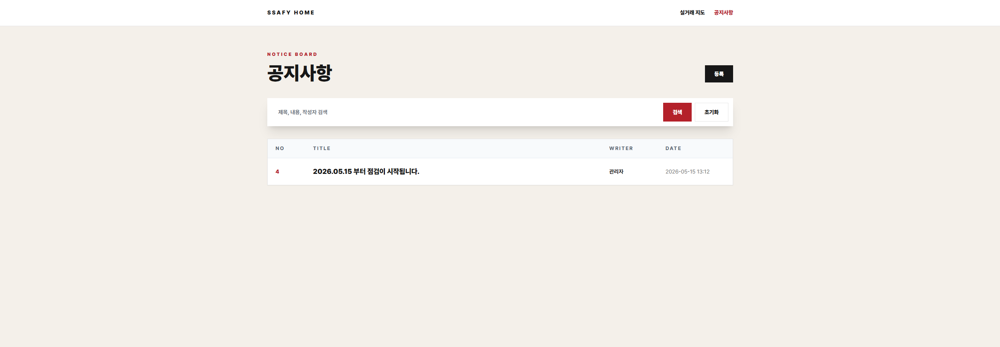
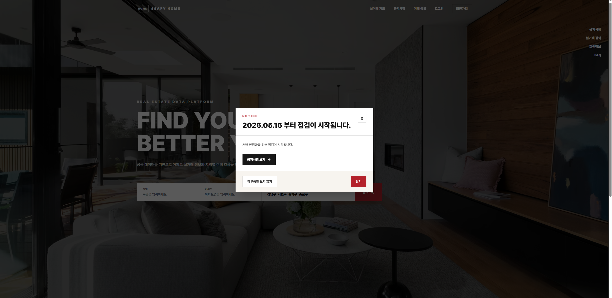
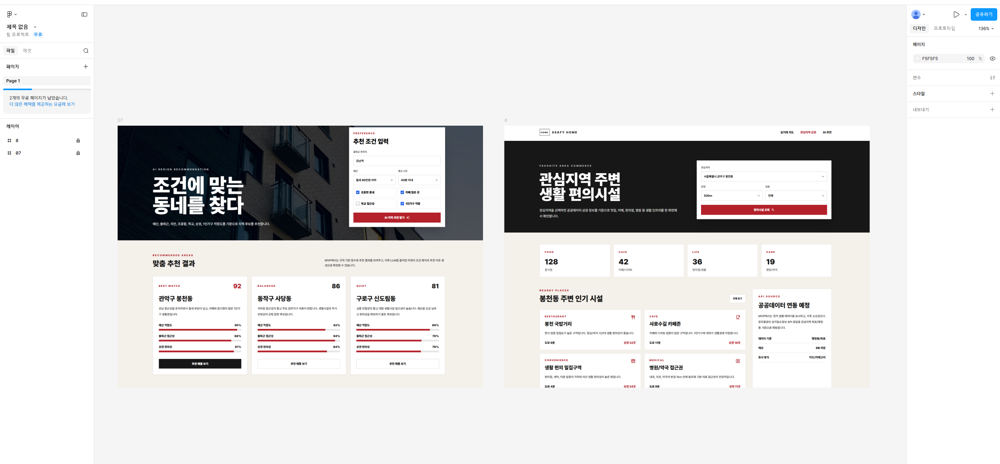

# 🏠 SSAFY HOME Spring Project

> 공공데이터 기반 주택 실거래가 정보를 검색하고 회원 관리 기능을 제공하는  
> Spring Boot 기반 부동산 정보 서비스 프로젝트입니다.

SSAFY HOME은 국토교통부 실거래가 공공데이터를 활용하여 사용자가 원하는 지역 및 아파트의 실거래 정보를 쉽고 빠르게 조회할 수 있도록 설계된 서비스입니다.

기존 SSAFY_HOME 프로젝트를 Spring Boot 기반 구조로 리팩토링하였으며, REST API 설계, Spring Security 기반 인증 처리, Swagger(OpenAPI) API 문서화까지 적용하여 유지보수성과 확장성을 강화했습니다.

또한 관심 지역 관리, 주변 상권 정보, 공지사항 기능 등 다양한 기능을 추가하여 확장 가능한 부동산 플랫폼 구현을 목표로 합니다.

---

# 🖥️ 서비스 화면

## 🏠 메인 페이지


- 실거래가 검색 서비스를 제공하는 메인 화면
- 지역 및 아파트 검색 가능
- 주요 서비스 메뉴 제공

---

## 🔍 실거래가 검색


- 동 이름 및 아파트명 기반 검색 기능 제공
- 조건 기반 검색 가능
- 사용자 친화적인 검색 UI 제공

---

## 📋 실거래가 검색 결과


- 검색 조건에 따른 실거래 목록 출력
- 거래 금액, 면적, 층수, 거래일 정보 제공
- 상세 정보 조회 가능

---

## 🏪 주변 상권 정보


- 선택 지역 기반 상권 정보 제공
- 주변 편의시설 및 상업시설 조회 가능
- 공공데이터 기반 지역 정보 제공

---

## 👤 회원가입


- 사용자 회원가입 기능 제공
- 입력값 검증 후 회원 정보 저장

---

## 🔐 로그인


- Spring Security 기반 로그인 처리
- 사용자 인증 기능 제공
- 로그인 성공 시 인증 정보 유지

---

## ❌ 로그인 실패


- 인증 실패 시 에러 메시지 출력
- 잘못된 계정 정보 안내

---

## 👤 마이페이지


- 회원 정보 조회 기능 제공
- 회원 정보 수정 가능
- 사용자 맞춤 기능 제공

---

## 📢 공지사항


- 공지사항 상세 조회 기능 제공
- 사용자에게 서비스 관련 정보 전달

---

## 📋 공지사항 목록


- 공지사항 리스트 출력
- 최신 공지사항 확인 가능

---

## 🪟 팝업 기능


- 이벤트 및 중요 공지 팝업 제공
- 사용자 알림 기능 구현

---

## 🎨 피그마 설계 화면


- 프로젝트 UI/UX 설계 화면
- 서비스 구조 및 디자인 설계

---

## 🖼️ 추가 화면
.png)

- 프로젝트 추가 구현 화면
- 사용자 기능 및 UI 구성 예시

---

# 🧭 작업 순서

## 1️⃣ 요구사항 분석 및 개선
- 기존 SSAFY_HOME 프로젝트 요구사항 분석
- 필수 기능 및 추가 기능 정의
- 서비스 개선 방향 및 확장 기능 도출

## 2️⃣ 기존 프로젝트 구조 분석
- 기존 MVC 구조 확인
- Database 구조 및 데이터 흐름 분석
- 화면 및 기능 구성 검토

## 3️⃣ Spring Boot 기반 구조 변경
- Spring MVC 기반 계층 구조 설계
- REST API 설계 및 구현
- Controller / Service / DAO 계층 분리
- MyBatis 기반 DB 연동 구현
- Spring Security 기반 인증/인가 처리
- Swagger(OpenAPI) 기반 API 문서화 적용

## 4️⃣ 결과 정리 및 산출물 제출
- 요구사항 명세 정리
- ERD 및 클래스 구조 정리
- README 및 프로젝트 문서화

---

# 📋 주요 기능

## 🏠 실거래 정보 관리

### ✔ 실거래가 검색
- 동 이름 기반 검색
- 아파트명 기반 검색
- 실거래 데이터 조회

### ✔ 상세 조회 기능
- 거래 금액
- 거래일
- 면적
- 층수
- 건축 연도
- 위치 정보 제공

### ✔ 주변 상권 조회
- 지역 기반 상권 정보 조회
- 공공데이터 연동 구조 설계

---

## 👤 회원 관리

### ✔ 회원가입
- 회원 정보 입력 및 저장

### ✔ 로그인 / 로그아웃
- Spring Security 기반 사용자 인증 처리
- Session 기반 로그인 유지

### ✔ 회원 조회 및 수정
- 사용자 정보 조회
- 회원 정보 수정 기능 제공

### ✔ 회원 탈퇴
- 회원 삭제 기능 제공

---

## 📢 공지사항 기능

### ✔ 공지사항 조회
- 공지사항 목록 조회
- 공지사항 상세 조회

---

## 🔐 인증 및 보안

### ✔ Spring Security 적용
- 인증 및 인가 처리
- 로그인 접근 제어
- 비밀번호 암호화 처리

### ✔ REST API 설계
- RESTful URI 설계
- HTTP Method 기반 API 구성
- JSON 데이터 처리

### ✔ Swagger(OpenAPI) 적용
- API 명세 자동화
- REST API 테스트 지원
- API 문서 시각화 제공

---

# 🏗️ 시스템 아키텍처

```text
Client
   ↓
Spring Security Filter
   ↓
DispatcherServlet
   ↓
Controller (REST API)
   ↓
Service
   ↓
DAO(MyBatis Mapper)
   ↓
MySQL Database
```

---

# 🧩 클래스 설계

## 🎮 Controller

| 클래스 | 역할 |
| --- | --- |
| `HomeController` | 메인 페이지 처리 |
| `HouseController` | 실거래가 검색 및 상세 조회 |
| `MemberController` | 회원가입 및 회원 관리 |
| `LoginController` | 로그인 / 로그아웃 처리 |
| `NoticeController` | 공지사항 처리 |
| `RegionController` | 지역 정보 조회 API |

---

## ⚙️ Service

| 클래스 | 역할 |
| --- | --- |
| `HouseService` | 실거래 검색 비즈니스 로직 |
| `MemberService` | 회원 관리 비즈니스 로직 |
| `NoticeService` | 공지사항 비즈니스 로직 |
| `RegionService` | 지역 정보 조회 로직 |

---

## 🗃️ DAO / Mapper

| 클래스 | 역할 |
| --- | --- |
| `HouseDao` | 실거래 정보 DB 조회 |
| `MemberDao` | 회원 정보 DB 처리 |
| `NoticeDao` | 공지사항 DB 처리 |
| `RegionDao` | 지역 코드 조회 |

---

# 🗄️ Database 설계

## 📦 주요 테이블

| 테이블 | 설명 |
| --- | --- |
| `dongcodes` | 행정동 코드 정보 |
| `houseinfos` | 아파트 기본 정보 |
| `housedeals` | 실거래가 정보 |
| `members` | 회원 정보 |
| `favorite_regions` | 관심 지역 정보 |
| `notices` | 공지사항 정보 |

---

# 🛠️ 기술 스택

## 💻 Backend
- Java 21
- Spring Boot
- Spring MVC
- Spring Security
- MyBatis
- Lombok

## 🎨 Frontend
- HTML5
- CSS3
- JSP
- Bootstrap

## 🗃️ Database
- MySQL

## 📖 API Documentation
- Swagger (OpenAPI)

## ⚙️ Build Tool
- Maven

---

# ▶️ 실행 방법

## 1️⃣ Database 생성

```sql
CREATE DATABASE ssafy_home;
```

---

## 2️⃣ application.properties 설정

```properties
spring.datasource.url=jdbc:mysql://localhost:3306/ssafy_home?serverTimezone=Asia/Seoul&characterEncoding=UTF-8
spring.datasource.username=ssafy
spring.datasource.password=ssafy
```

---

## 3️⃣ 프로젝트 실행

```bash
./mvnw spring-boot:run
```

Windows PowerShell:

```powershell
.\mvnw.cmd spring-boot:run
```

---

# 🌐 접속 주소

## 메인 페이지

```text
http://localhost:8080
```

## Swagger API 문서

```text
http://localhost:8080/swagger-ui/index.html
```

---

# 🌟 프로젝트 특징

- Spring Boot 기반 MVC 아키텍처 적용
- REST API 기반 서버 구조 설계
- Spring Security 기반 인증 및 인가 처리
- Swagger(OpenAPI) 기반 API 문서 자동화
- MyBatis 기반 데이터 접근 계층 구현
- 공공데이터 기반 실거래가 검색 서비스
- 회원 인증 및 세션 관리 기능 구현
- 공지사항 및 상권 정보 기능 제공
- 계층 분리를 통한 유지보수성 향상

---

# 🔮 향후 개선 사항

- 관심 지역 등록 및 추천 기능 구현
- Kakao Map API 연동
- 실시간 부동산 뉴스 제공
- 상권 및 환경 정보 시각화
- JWT 기반 인증 구조 고도화
- Redis 기반 로그인 세션 관리
- Docker 및 CI/CD 환경 구축

---

# 🎯 프로젝트 목표

> Spring Boot, Spring Security, MyBatis를 활용하여  
> 주택 실거래가 정보 검색과 회원 관리를 제공하는  
> 확장 가능한 부동산 정보 서비스를 구현한다.